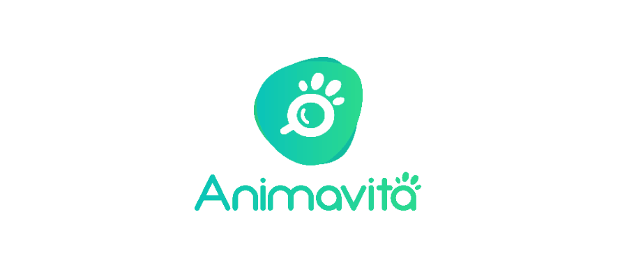

# Projeto com README
Um projeto de teste com um arquivo README 🚀

  

 ## Tecnologias utilizadas
 - HTML
 - CSS
 - JS

 ## Como utilizar
 1 - Clone pro o projeto
 ...

 2 - Git clone (url)
 ...

 3 - Acesse a pasta do projeto 
 ...

 4 - Cd repositorio readme
